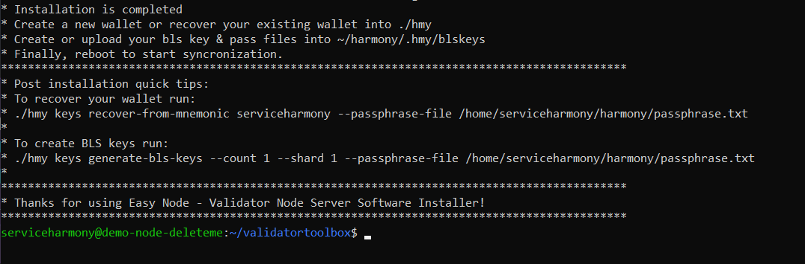

import Callout from 'nextra-theme-docs/callout'

# Harmony ONE Documents Companion Guide by Easy Node Community
Welcome to Easy Node Community's Companion guide. Here we cover what it takes to become a Validator on Harmony ONE and what you can expect along the journey.
## Validator Operator Companion Guide
> **Hey current & future validators, we're professional systems administrators and we're here to help.**

> While [the Official Harmony $ONE Validator guide](https://docs.harmony.one/home/network/validators) is quite amazing and helpful, there are some gaps left that may leave some new administrators with questions. We'll tackle all those and more here.
---
## What is a Harmony Validator?
> Technically a _**validator**_ lives on the blockchain \(For Harmony Validators it's simply a Harmony Wallet of your choice that you would like to use as your public Validator Address which we mark on the blockchain as a "validator"\) and the _**nodes**_ \(The Linux Servers that verify & sign blocks\) sign the transaction blocks on behalf of the validator's wallet.
> Here we focus on building and running the nodes but we'll also use commands to setup and manage the validator along the way.
---
## Easy Node's Validator Toolbox Installer & Menu Application
> As of 9/21/2021 our [Easy Node Validator Toolbox Installer](https://validator-toolbox-guide.easynode.one) is now available. It makes most of the data in this guide no longer needed. Check that out today to learn how to setup your server. This guide will stay up as is for reference and help as you'll need to know how to run every command manually.
_**This guide is provided without warranty or support. Use all commands at your own risk. Know your environment and the command before executing them.**_
> If you run into issues during your setup the best place to reach out for help is the [Harmony Mainnet Staking Telegram Channel](https://t.me/PangaeaVolunteers). A team of community volunteers is waiting to assist if you have any questions.
