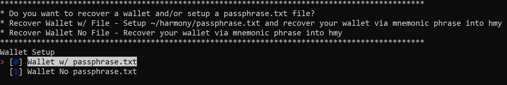
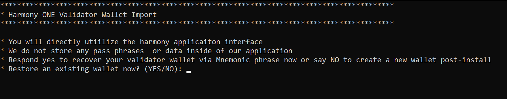

# Firewall Setup Notes
For your firewall we only suggest opening up the minimum required ports publicly.  
---
## **Open Ports**
    - 6000 TCP  
    - 9000 TCP
## SSH Access 
This runs over port 22, we suggest locking this port down to your home or work public IP addresses to only allow access from known internet spots. ****
> If you use Digital Ocean Networking Firewall continue reading.
> You can [visit this website](https://www.whatismyip.com/) to get the IP you're currently using on the public internet.
## Digital Ocean Networking Firewall Setup
Digital Ocean Networking Firewall
> If you're on Digital Ocean their firewall is much more user friendly than UFW or an alternative. Here's our notes on using the Digital Ocean Firewalls.
## Inbound Rules
Below is our standard firewall configuration for Validator droplets.
> 
    * **All TCP** - 127.0.0.1 - This address is the local host IP, it allows the droplets to use their ports. No other IPs in this field.
    * **SSH** - Your IPs - Add the IPs you want to allow to connect to SSH here. This is IP is your home or business public IP which can be [seen here](https://whatismyip.com).
    * **Custom Ports** - 6000 & 9000 - All IPv4, All IPv6 is fine for now. We will be reaching out to determine if these ports can be locked down to specific Harmony related addresses.
> _**You will need to go into Digital Ocean and update the firewall rules if your IP addresses you added to SSH changes for any reason or if you need an additional location authorized**_
> 
> _**DO NOT OPEN "ALL TCP - TCP - All Ports" OR "SSH - TCP - 22" TO EITHER All IPv4 or All IPv6**_ 
> 
> _**If you allow anyone from anywhere on the internet into those ports that makes your server insecure and puts your wallet at risk!**_
UDP may be used in the future, we're monitoring this. Always stay up to date in the [staking telegram channel](https://t.me/PangaeaVolunteers).
## Outbound Rules
These can be left as default.
> 