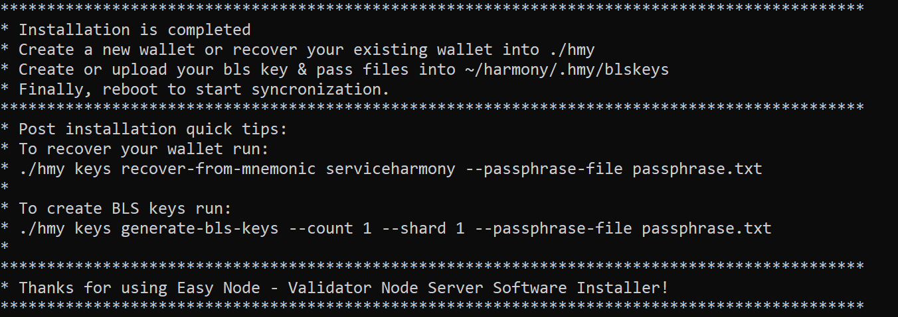

#### What to expect before becoming a validator
---

# Before setting up nodes

Before you get started on making a validator we'll be covering these things that come up often:

Here's a long list of things to read and think about before you proceed with jumping into becoming a validator.

### How much time does it take to manage a validator?

Let's start here. We get this question quite often.  
  
At first running a validator doesn't take much time but that scales as the number of $ONE delegated to your validator grows. At certain points you'll need to make decisions on BLS keys, Shards and the total number of servers in your infrastructure.

Harmony believes you can run just 1 server per node and have a proper 99%+ uptime on your validator node. Some validators choose to run redundant nodes with identical wallets, .key & .pass files from your initial node moved over to assist with signing. This is not required and doubles the cost of your validator per month.

### Linux Administrator Skills

You'll have to commit to learning how to become a Linux Administrator, keep up with the server admin changes for Harmony and have time to assist your delegators if issues arise.

In reality you should probably already have a few years of Linux systems administrations skills under your belt already if you decide to get into running a validator. Here's some things to be familiar with.

* Understand _**every command**_ you run before you execute it and why you are performing it
* Be familiar with _**virtual machines and Ubuntu Server**_
* Know how to _**create, manipulate and update files and directories**_
* Know how to _**manage file permissions**_
* Know how to _**create users and manage permissions**_
* Know how to _**manage and modify bash scripts**_
* Know how to _**manage services**_
* Know how to _**read logs and troubleshoot issues**_ that may arise.

If you're no longer interested any further at running a validator [staking is a wonderful option](https://bit.ly/slugomvalidator) with a lot less work to get a bigger reward than validators make off of fees.

If you're familiar with most of this you can skip to the parts you need more info on or go straight to our [Post Install - Pro Tips section](../../after-node-setup/advanced-tips.md).

If you do not know how to complete the tasks on the list above keep reading before you decide to jump into the life of 18 hour cycles as full time validator.

## General Help

If you run into issues during your setup the best place to reach out for help is the [Harmony Mainnet Staking Telegram Channel](https://t.me/PangaeaVolunteers). A team of community volunteers is waiting to assist if you have any questions.

### Cloud Server Provider

Currently we split our services between [Digital Ocean](https://m.do.co/c/b761e5fdd694) and [Vultr](https://www.vultr.com/?ref=8873853). 

**You're free to use anyone you'd like** but our guide is written for **Ubuntu 20.04 LTS** **on a Digital Ocean droplet or Vultr server.**

Just keep in mind you'll pay a lot more at any of the big 3 providers AWS, Azure or GCP if you run a Harmony Validator Node there.

You only need 2 servers to start \(on either testnet or mainnet\). A pair of servers is good to run up to 10 slots before you need to tweak the configuration files to run more or decide if you need a 2nd pool on another shard.

See our [Cloud Setup](../../validator-guide-notes/software-setup/cloud-setup.md#server-requirements) section for the requirements.

### Operating System

We use Ubuntu 20.04 LTS only as recommended by Harmony. 

### Initial Wallet & Funds

If you're going to use a Ledger Nano S address you'll already have that setup, most likely.

If you need a new wallet for the validator we suggest making one in Harmony ONE Chrome, capturing your private data as you set it up so you can then import that wallet on your nodes.

### Making a local [User Account](../pre-setup-hurdles/user-accounts.md)

Decide on the name for a local non-root account to run the Harmony application as a service \(don't pick root or harmony as the account name\). The username should be all lower case. You'll get errors if you're  using capital letters in your username on Ubuntu.

Do not run your software as root - it's just a terrible idea. Set up an account and use a folder for the software.

### Determine a [Folder Location](../pre-setup-hurdles/harmony-folder.md#create-harmony-folder)

Our suggested placement is at ~/harmony and our companion guide has commands to setup the folder before starting your work on the official guide.

### Use [SSH Key Login](../pre-setup-hurdles/user-accounts.md#setup-ssh-key-login-for-new-user)

Our suggested method of logging into our Linux servers. 

[Here is the guide](https://www.digitalocean.com/community/tutorials/how-to-set-up-ssh-keys-on-ubuntu-20-04) on how to create SSH key pairs, follow it and set them up in the digital ocean interface as well so you can preload it when you login.

### Pick your shards

Decide on your shard setup. We encourage making your BLS keys on any of the numbered shards 1-3 instead of shard 0 at this current time.

Loading a 2nd shard requires a 2nd database that currently takes around 9.3GB.

### Have enough storage for the future

Currently you will need around 120GB to get started but plan on 30GB+ a month or more as transactions increase.

### Wallet for the validator

Are you using a brand new wallet or recycling? We suggest a separate, secure, new wallet away from the one you use regularly for staking already to avoid mishaps. You'll make a new wallet as part of the official guide if you read it literally but we've set up some commands for importing your mnemonic phrase into your account storage.

### Testnet

Should I run on Testnet first? If you're new to linux or validating, yes.

Harmony has a 2nd blockchain running for you to test on. We advise setting  your first server up there and getting elected. Luckily, the official guide has tabs for all of the commands to use for Testnet vs Mainnet so it's just as easy to setup.

Keep an eye out for command windows that will have tabs to choose between Main or Test.

